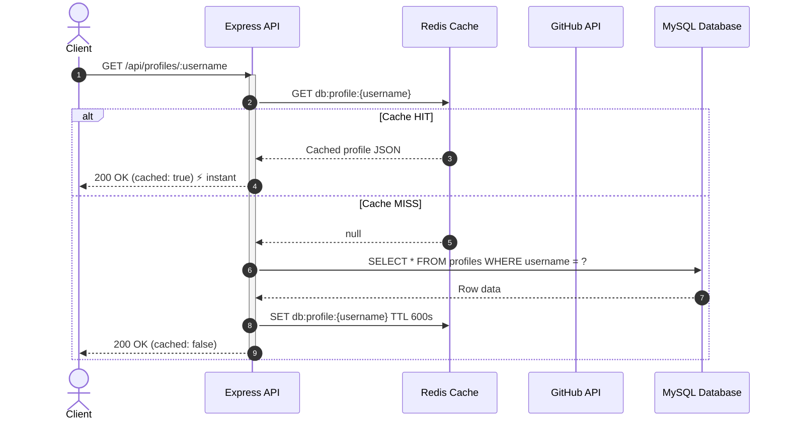

GITHUB PROFILE ANALYZER API
===========================

[](https://nodejs.org/)
[](https://expressjs.com/)
[](https://www.mysql.com/)
[](https://redis.io/)
[](https://www.docker.com/)
[](https://opensource.org/licenses/ISC)

[GitHub Profile Analyzer API](https://github.com/palashtinkhede/github-analyzer) is a highly performant REST API backend service built with **Node.js** and **Express.js**. It fetches GitHub user profiles, extracts deep insights (aggregate stars, forks, top languages, account age, etc.), and stores them in a **MySQL** database with a **Redis** caching layer for near-instant repeated reads. The application supports profile analysis, pagination, sorting, side-by-side comparisons, cache management, validation, and rate-limiting, and the entire stack can be run containerized with **Docker** and **Docker Compose**.


## Overview
The GitHub Profile Analyzer API is an enterprise-ready, easy-to-use backend service that leverages local database persistence and distributed caching. Some key features include:

1. **Redis caching:** 4-layer caching system for GitHub profiles, repository lists, database results, and paginated listings with auto-invalidation on re-analysis.
2. **Profile aggregation and analysis:** Aggregates raw data from the GitHub API into a rich analytical summary containing developer archetypes and metrics.
3. **Developer archetypes:** Dynamically classifies developers into profiles such as Open Source Rockstar, Prolific Builder, or High-Impact Specialist.
4. **Power scores and head-to-head:** A weighted scoring system for fair side-by-side comparison of two developers.
5. **Language insights:** Detailed breakdowns of common languages and unique language overlaps between developers.
6. **Cache management:** Dedicated endpoints to manually clear cache per user or inspect real-time cache statistics (hit/miss rate).

## Architecture
The following diagram outlines the high-level architecture of the GitHub Profile Analyzer:



### Request Lifecycle
The following sequence diagram outlines the request lifecycle and caching layers:



### Caching Flow
1st request:  Client → API → Redis MISS → GitHub API → MySQL upsert → Redis SET → Response
2nd request:  Client → API → Redis HIT → Response instantly (no GitHub call, no DB query)

### Cache Layers & TTL

| Cache Key Pattern | Source | TTL |
|:---|:---|:---|
| `github:profile:{username}` | GitHub `/users/:username` | 1 hour |
| `github:repos:{username}` | GitHub `/users/:username/repos` | 1 hour |
| `db:profile:{username}` | MySQL single profile | 10 minutes |
| `db:profiles:page:*` | MySQL paginated list | 5 minutes |

> ***Note*** : Cache is automatically invalidated when running `POST /api/analyze/:username` to guarantee fresh data when requested.

## System Requirements
To run the GitHub Profile Analyzer API stack, the following minimum system specifications are recommended:

| Component | Requirements |
|:---|:---|
| Runtime | Node.js v18.0.0 or higher |
| Database | MySQL v8.0 or higher (runs locally or via Docker) |
| Cache | Redis v7.x or higher (runs locally or via Docker Compose) |
| Containerization | Docker Desktop and Docker Compose (v2.x recommended) |
| Network | External access to GitHub API (`api.github.com`) |
| Auth Token | GitHub Personal Access Token (PAT) to avoid rate limits |

## Installation Guide

Follow these steps to install and configure all required components (MySQL, Redis, and the Node.js backend server) on your local machine.

### 1. Install Node.js
If you do not have Node.js installed, download and install the LTS version:
* Download from the [Node.js Official Website](https://nodejs.org/).
* Verify your installation:
  ```bash
  node -v
  npm -v
  ```

### 2. Install & Configure MySQL
The backend requires a MySQL database to persist profile analysis.

#### Option A: Local Native Installation
1. Download and install **MySQL Community Server** from the [MySQL Downloads Page](https://dev.mysql.com/downloads/mysql/).
2. During installation, set a password for the `root` user and start the MySQL service.
3. Access the MySQL command-line client or any GUI client (like MySQL Workbench, DBeaver) and create the database:
   ```sql
   CREATE DATABASE github_analyzer;
   ```

#### Option B: Docker Container Installation
If you prefer running MySQL in Docker without installing it locally:
1. Run the official MySQL container:
   ```bash
   docker run --name local-mysql -e MYSQL_ROOT_PASSWORD=your_mysql_password -e MYSQL_DATABASE=github_analyzer -p 3306:3306 -d mysql:8.0
   ```

### 3. Install & Configure Redis
Redis is used as the high-speed caching layer.

#### Option A: Local Installation
* **macOS:** Install via Homebrew:
  ```bash
  brew install redis
  brew services start redis
  ```
* **Linux (Ubuntu/Debian):** Install via APT:
  ```bash
  sudo apt update
  sudo apt install redis-server
  sudo systemctl start redis-server
  ```
* **Windows:** Install Redis via WSL (Windows Subsystem for Linux) or download the MSI installer from [Redis for Windows](https://github.com/tporadowski/redis/releases).

#### Option B: Docker Container Installation (Recommended)
You can spin up a standalone Redis container instantly:
1. Start the Redis container:
   ```bash
   docker run --name local-redis -p 6379:6379 -d redis:7-alpine
   ```
2. Verify Redis is running by pinging the container:
   ```bash
   docker exec -it local-redis redis-cli ping
   # Expected output: PONG
   ```

### 4. Setup Backend Server

1. **Clone the repository and navigate to the project directory:**
   ```bash
   git clone <repository-url>
   cd github-analysis-with-redis
   ```
2. **Install Node.js dependencies:**
   ```bash
   npm install
   ```
3. **Configure Environment Variables:**
   Create a `.env` file in the root folder (or copy `.env.example`):
   ```env
   PORT=3000
   DB_HOST=127.0.0.1
   DB_USER=root
   DB_PASSWORD=your_mysql_password
   DB_NAME=github_analyzer
   GITHUB_TOKEN=ghp_YourGitHubPersonalAccessToken
   
   # Redis connection URL and TTL values (in seconds)
   REDIS_URL=redis://localhost:6379
   REDIS_TTL_GITHUB=3600
   REDIS_TTL_DB_SINGLE=600
   REDIS_TTL_DB_LIST=300
   ```
   > ***Note*** : You must provide a valid `GITHUB_TOKEN` (Personal Access Token) to prevent hitting GitHub's API rate limits (which limit unauthenticated IPs to only 60 requests per hour).

4. **Initialize Database Schema:**
   Run the database initialization script to create the necessary tables:
   ```bash
   node src/config/setupDb.js
   ```
   *Expected Output:*
   ```text
   Database "github_analyzer" checked/created.
   Table "profiles" created or already exists.
   Database setup completed successfully!
   ```

5. **Start the application:**
   * **For Development (with nodemon auto-restart):**
     ```bash
     npm run dev
     ```
   * **For Production:**
     ```bash
     npm start
     ```

---

## Running with Docker Compose

If you have Docker and Docker Compose installed, you can boot the entire stack (or just Redis) with a single command.

### Boot Redis Container Only
Since you are using a local MySQL instance, you only need Redis running in Docker:
1. Start the Redis container service:
   ```bash
   docker compose up -d
   ```
2. Run the Node.js application locally:
   ```bash
   npm run dev
   ```

### Boot the Full Stack (If configured)
If your `docker-compose.yml` has the MySQL and Node.js services configured:
1. Add your `GITHUB_TOKEN` in the `.env` file.
2. Spin up all services:
   ```bash
   docker compose up --build
   ```

## Documentation
The API provides several endpoints for analyzing profiles, comparisons, and cache management. All GET responses include a `cached` boolean indicator.

### API Endpoints

| Method | Path | Description |
|:---|:---|:---|
| `GET` | `/` | Health check & endpoint listing |
| `POST` | `/api/analyze/:username` | Fetch from GitHub, store in DB & cache |
| `GET` | `/api/profiles` | All profiles (paginated, cached) |
| `GET` | `/api/profiles/:username` | Single profile (cached) |
| `GET` | `/api/compare?a=u1&b=u2` | Compare two profiles (cache-aware) |
| `DELETE` | `/api/profiles/:username` | Delete profile + clear its cache |
| `DELETE` | `/api/cache/:username` | Clear cache only (keep DB record) |
| `GET` | `/api/cache/stats` | Redis hit/miss statistics |

### Schema Structure (`profiles` table)

| Column Name | Type | Description |
|:---|:---|:---|
| `id` | `INT` | Primary Key, auto-incremented |
| `username` | `VARCHAR(100)` | Unique GitHub login handle — indexed |
| `name` | `VARCHAR(200)` | Full public name |
| `bio` | `TEXT` | Public biography |
| `avatar_url` | `VARCHAR(500)` | Profile avatar link |
| `location` | `VARCHAR(200)` | Listed location |
| `company` | `VARCHAR(200)` | Current corporate association |
| `blog` | `VARCHAR(300)` | Personal site or blog URL |
| `email` | `VARCHAR(200)` | Public email address |
| `twitter_username` | `VARCHAR(100)` | Public Twitter handle |
| `public_repos` | `INT` | Total public repositories |
| `public_gists` | `INT` | Total public gists |
| `followers` | `INT` | Followers count — indexed |
| `following` | `INT` | Following count |
| `total_stars` | `INT` | Cumulative stars across all repos — indexed |
| `total_forks` | `INT` | Cumulative forks across all repos |
| `account_age_days` | `INT` | Age of the GitHub account in days |
| `top_languages` | `JSON` | Array of top 5 languages used |
| `most_starred_repo` | `VARCHAR(300)` | Name of the most starred repository |
| `most_starred_count` | `INT` | Stars on the most starred repository |
| `hireable` | `TINYINT(1)` | Hireable status |
| `site_admin` | `TINYINT(1)` | GitHub Site Admin status |
| `github_created_at` | `DATETIME` | Original creation date on GitHub |
| `analyzed_at` | `TIMESTAMP` | Time of original analysis insertion |
| `updated_at` | `TIMESTAMP` | Time of the last profile sync |

### Endpoint Details

#### 1. Analyze Profile
Fetches fresh data from GitHub, extracts insights, upserts into MySQL, caches the result, and returns it.
- **Method**: `POST`
- **Path**: `/api/analyze/:username`
- **Response**: `200 OK`
  ```json
  {
    "success": true,
    "cached": false,
    "message": "Profile for \"octocat\" analyzed and stored",
    "data": {
      "id": 1,
      "username": "octocat",
      "name": "The Octocat",
      "followers": 9800,
      "total_stars": 150,
      "top_languages": "[\"Ruby\",\"HTML\",\"CSS\"]",
      "analyzed_at": "2026-05-31T00:00:00.000Z"
    }
  }
  ```

#### 2. Get All Profiles (Paginated)
- **Method**: `GET`
- **Path**: `/api/profiles`
- **Query Params**: `page`, `limit` (max 100), `sort` (`followers`|`total_stars`|`public_repos`|`analyzed_at`), `order` (`asc`|`desc`)
- **Response**: `200 OK`
  ```json
  {
    "success": true,
    "cached": true,
    "data": [ { "username": "octocat", "followers": 9800 } ],
    "pagination": { "page": 1, "limit": 10, "total": 1, "pages": 1 }
  }
  ```

#### 3. Get Single Profile
- **Method**: `GET`
- **Path**: `/api/profiles/:username`
- **Response**: `200 OK`
  ```json
  {
    "success": true,
    "cached": true,
    "data": { "username": "octocat", "followers": 9800 }
  }
  ```

#### 4. Compare Two Profiles
Both profiles must be analyzed first. Returns archetypes, power scores, head-to-head stats, language overlaps, and an ultimate winner.
- **Method**: `GET`
- **Path**: `/api/compare?a=octocat&b=defunkt`
- **Response**: `200 OK`
  ```json
  {
    "success": true,
    "cached": false,
    "data": {
      "profiles": {
        "octocat": {
          "archetype": "High-Impact Specialist (Few repos, high stars)",
          "power_score": 50940,
          "average_stars_per_repo": 18.75,
          "average_forks_per_repo": 10.0
        },
        "defunkt": {
          "archetype": "Open Source Rockstar",
          "power_score": 113994,
          "average_stars_per_repo": 2.99,
          "average_forks_per_repo": 4.12
        }
      },
      "head_to_head": {
        "most_followers": "defunkt",
        "most_stars": "defunkt",
        "most_repos": "defunkt",
        "older_account": "defunkt",
        "higher_average_stars": "octocat",
        "higher_power_score": "defunkt"
      },
      "language_insights": {
        "common_languages": ["Ruby", "JavaScript"],
        "unique_to": {
          "octocat": ["HTML", "CSS"],
          "defunkt": ["Shell", "C"]
        }
      },
      "ultimate_winner": "defunkt"
    }
  }
  ```

#### 5. Delete Profile
Removes the profile from MySQL and clears all associated Redis cache entries.
- **Method**: `DELETE`
- **Path**: `/api/profiles/:username`
- **Response**: `200 OK`
  ```json
  {
    "success": true,
    "message": "Profile \"octocat\" deleted from DB and cache"
  }
  ```

#### 6. Clear User Cache
Invalidates all Redis cache for a specific user without touching the database record.
- **Method**: `DELETE`
- **Path**: `/api/cache/:username`
- **Response**: `200 OK`
  ```json
  {
    "success": true,
    "message": "All cache cleared for \"octocat\". Next request will fetch fresh data."
  }
  ```

#### 7. Cache Statistics
Returns Redis connection status and hit/miss metrics.
- **Method**: `GET`
- **Path**: `/api/cache/stats`
- **Response**: `200 OK`
  ```json
  {
    "success": true,
    "redis": {
      "connected": true,
      "totalKeys": 4,
      "hits": 12,
      "misses": 3,
      "hitRate": "80.0%"
    }
  }
  ```

## Source code
The application's source files are organized as follows:

| Module | Purpose / Responsibility |
|:---|:---|
| `src/app.js` | Express app entrypoint, middleware registration, port binding |
| `src/config/db.js` | MySQL connection pool initialization |
| `src/config/redis.js` | Redis client setup and get/set/delete helper functions |
| `src/config/setupDb.js` | Database table creation script |
| `src/controllers/profileController.js` | Business logic implementation with caching strategy |
| `src/routes/profiles.js` | Express router definition with request parameter validators |
| `src/services/githubService.js` | Service contacting GitHub API (and caching raw GitHub JSON) |
| `src/services/insightsService.js` | Utility extracting analysis, developer archetypes, power scores |

## Testing & Troubleshooting

### Caching Verification Steps

1. **Analyze a user:** Initial cache MISS (fetches from GitHub & writes to MySQL/Redis)
   ```bash
   curl -X POST http://localhost:3000/api/analyze/torvalds
   ```
2. **Retrieve the profile:** Cache HIT (returns instantly from Redis)
   ```bash
   curl http://localhost:3000/api/profiles/torvalds
   ```
3. **Check Cache Metrics:** View Redis statistics
   ```bash
   curl http://localhost:3000/api/cache/stats
   ```
4. **Invalidate Cache:** Deletes user cache keys
   ```bash
   curl -X DELETE http://localhost:3000/api/cache/torvalds
   ```

### Troubleshooting Guide

| Issue / Error | Actionable Fix |
|:---|:---|
| `Cannot find module 'ioredis'` | Run `npm install ioredis` to install it. |
| `Redis ECONNREFUSED` | Ensure Redis is running or start it using `docker compose up -d redis`. |
| `Cache always shows "cached": false` | Verify `REDIS_URL` config. Inside Docker, use `redis://redis:6379`. |
| `GitHub API rate limit exceeded` | Provide a valid `GITHUB_TOKEN` in your `.env` file. |
| `MySQL ECONNREFUSED` | Check MySQL database host and credentials in your `.env` file. |
| `Port 6379 already in use` | Map a different host port in `docker-compose.yml` (e.g. `"6380:6379"`). |
| `Port 3306 already in use` | Stop local MySQL or map a different port. |
| `docker compose: command not found` | Update Docker Desktop or use the old syntax `docker-compose`. |
